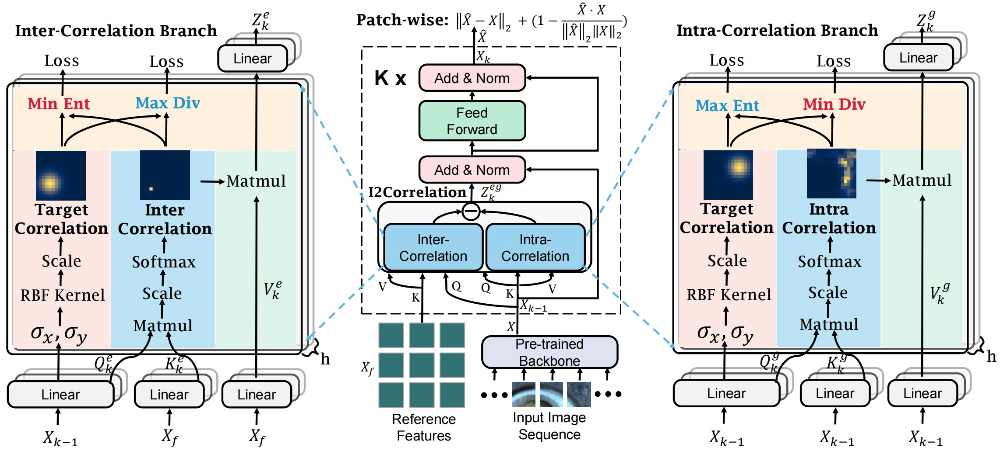

## [Focus the Discrepancy: Intra- and Inter-Correlation Learning for Image Anomaly Detection](https://arxiv.org/abs/2308.02983)

PyTorch implementation and for ICCV2023 paper, Focus the Discrepancy: Intra- and Inter-Correlation Learning for Image Anomaly Detection.



---

## Installation
Install all packages (the same version with ours) by the following command:
```
$ pip3 install -r requirements.txt
```

## Download Datasets
Please download MVTecAD dataset from [MVTecAD dataset](https://www.mvtec.com/de/unternehmen/forschung/datasets/mvtec-ad/), BTAD dataset from [BTAD dataset](http://avires.dimi.uniud.it/papers/btad/btad.zip), and MVTec3D dataset from [MVTec3D dataset](https://www.mvtec.com/company/research/datasets/mvtec-3d-ad).

## Creating Distance Maps
Please run the following code for creating distance maps used in target correlations. 
<!--Or you can unzip the ``data.zip``, and use our calculated distance maps in the data/distances folder.-->
```
python create_distance_maps.py 
```

## Creating Reference Features
Please run the following code for generating external reference features (based on ``wide_resnet50``). 
<!--Or you can unzip the ``data.zip``, and use our generated reference features in the data/rfeatures_w50 folder.-->
```bash
# For MVTecAD
python create_ref_features.py --dataset mvtec --data_path /path/to/your/dataset --backbone_arch wide_resnet50_2 --save_path rfeatures_w50
# For BTAD
python create_ref_features.py --dataset btad --data_path /path/to/your/dataset --backbone_arch wide_resnet50_2 --save_path rfeatures_w50
# For MVTec3D-RGB
python create_ref_features.py --dataset mvtec3d --data_path /path/to/your/dataset --backbone_arch wide_resnet50_2 --save_path rfeatures_w50
```


## Training and Evaluating
In this repository, we use ``wide_resnet50`` as the feature extractor by default.
As we find this can get slightly better results than ``efficientnet-b6`` reported in the paper.

- Run code for training and evaluating MVTecAD
```bash
python main.py --dataset mvtec --data_path /path/to/your/dataset --backbone_arch wide_resnet50_2 --rfeatures_path rfeatures_w50 --with_intra --with_inter --save_prefix mvtec
```
- Run code for training and evaluating BTAD
```bash
python main.py --dataset btad --data_path /path/to/your/dataset --backbone_arch wide_resnet50_2 --rfeatures_path rfeatures_w50 --with_intra --with_inter --save_prefix btad
```
- Run code for training and evaluating MVTec3D-RGB
```bash
python main.py --dataset mvtec3d --data_path /path/to/your/dataset --backbone_arch wide_resnet50_2 --rfeatures_path rfeatures_w50 --with_intra --with_inter --save_prefix mvtec3d
```

## Citation

If you find this repository useful, please consider citing our work:
```
@article{FOD,
      title={Focus the Discrepancy: Intra- and Inter-Correlation Learning for Image Anomaly Detection}, 
      author={Xincheng Yao and Ruoqi Li and Zefeng Qian and Yan Luo and Chongyang Zhang},
      year={2023},
      booktitle={International Conference on Computer Vision 2023},
      url={https://arxiv.org/abs/2308.02983},
      primaryClass={cs.CV}
}
```


